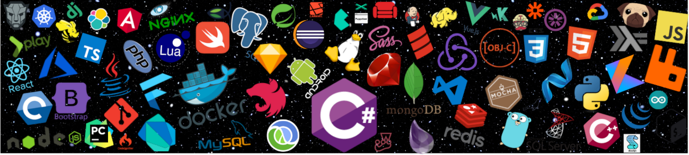

<!---https://rahuldkjain.github.io/gh-profile-readme-generator/-->

  

<h1 align="center">Hi 👋, I'm Elimar</h1>
<h3 align="center">Back-end Development</h3>
<h4 align="center">I'm a software engineer at XP Inc., in my free time I like to read and be with my 
family.</h4>

- 🔭 I’m currently working on [Customer-API](https://github.com/ElimarLucena/Customer-API)

- 🌱 I’m currently learning **Safe development with .Net Core**

- 👨‍💻 All of my projects are available at [Github Projects](https://github.com/ElimarLucena?tab=repositories)

- 💬 Ask me about **.Net Core, C#, SQL Server, Security**

- 📫 How to reach me **elimarlucenar@gmail.com**

<!---

-->
<!---

-->

<h3 align="left">Connect with me:</h3>

<!--  -->
<a href="https://github.com/ElimarLucena" target="blank">                                                              

<h3 align="left">Languages and Tools:</h3>

 
   
   
   
   
  
   
  

